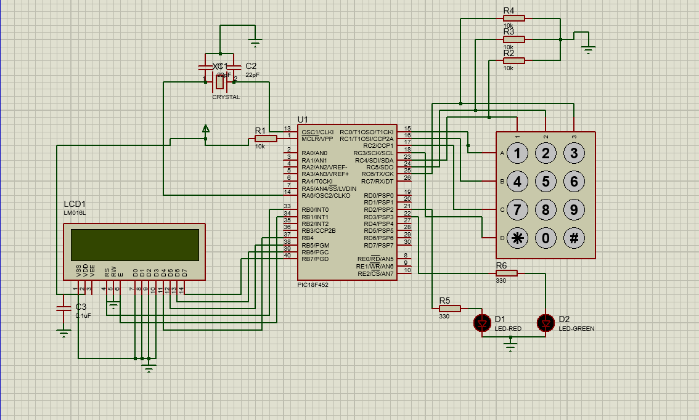

# Password-Security-PIC18F
Password-Based Security Lock System using PIC18F452

A secure 4-digit password authentication system built using the PIC18F452 microcontroller, a 4×3 matrix keypad, 16×2 LCD, and LED indicators.
Supports password entry, validation, and a Change Password feature implemented in Embedded C (XC8).

## Features

- 4-digit password authentication
- Change Password mode (# key)
- Backspace support (* key)
- Masked input displayed as stars
- LED indication for success and failure
- Automatic reset to login screen after each attempt

## Hardware Requirements

- PIC18F452 Microcontroller
- 16×2 LCD (HD44780 compatible)
- 4×3 Matrix Keypad
- Red and Green LEDs
- 10 kΩ pull-down resistors (for keypad columns)
- 220 Ω resistors (for LEDs)
- 16 MHz crystal oscillator and two 22 pF capacitors
- 9 V Battery
- 7805 Voltage Regulator IC
- Jumper Wires
- Breadboard

## Circuit Connections

## How It Works

- The system begins by displaying "Enter Password:" on the LCD.

- The user inputs a 4-digit password through the keypad.

- Input is masked using asterisks for security.

### Upon submission:

- If correct, the green LED turns on and “Access Granted” is displayed.

- If incorrect, the red LED blinks and “Try Again” is displayed.

- Pressing * deletes the last digit.

- Pressing # enters Change Password mode, where the old password must be entered before registering a new password.

- After each operation, the system returns to the password entry screen.

## Project Code

The complete code is contained in the main.c file.
